# Secure MongoDB with Encryption at Rest using Gemalto Safenet KeySecure

*Disclaimer - the demo in the following article is made on a Standalone Mongo and not a Replica Set. For this reason, the demo is intended for a test environment.*

### Overview

Encyption at Rest, different from Encryption on-the-fly, means encrypting data that are not moving through network. To Encrypt data at Rest, you can either encrypt them via your application, encrypt directly the volume, encrypt the filesystem, etc.  
Lucky you are, MongoDB provides a native Encryption at Rest feature (only available with WiredTiger storage engine and MongoDB Enterprise Version).

SafeNet KeySecure by Gemalto is an encryption and key management appliance that securely stores MongoDB native encryption keys.  
MongoDB is taking care of everything, you only use Safenet KeySecure as a Keys Store.

In this tutorial, I will describe the detailed process of setting up a MongoDB Standalone with Encryption at Rest using Gemalto Safenet KeySecure.  
The process to encrypt a MongoDB ReplicaSet is similar as you can encrypt each node independently from each other. To demonstrate the independence between nodes, you could configure a 3 Nodes Replica Set, with 2 nodes encrypted and one node unencrypted, without any impact. Though of course this wouldn't make any sense!

The bulk part of the work for setting up Encryption at Rest would be to create the certificates in order to setup the TLS (Transport Layer Security) between your MongoDB Instance and the KMIP (Key Management Interoperability Protocol) Server manager by Safenet KeySecure.  
Fortunately, you will use the Safenet KeySecure Web Console to perform most of the operations. 

To enable Encryption at Rest on 1 standalone, essentially you will need the following set of certificates:

* 1x certificate for the Root CA
* 1x server certificate for the KMIP Server
* 1x client certificate for the MongoDB Standalone - Optional (Mandatory if Client Authentication enabled)

### Preparation

* 1 AWS Account.
* One linux box, I tested on Amazon Linux but it works with other distributions.
* One Safenet Virtual KeySecure v8.3 (you can ask for a trial license)
* [Download and Install MongoDB Enterprise 3.4](https://docs.mongodb.com/manual/tutorial/install-mongodb-enterprise-on-red-hat/)
* [Install Safenet KeySecure using documentation](http://www2.gemalto.com/aws-marketplace/usage/vks/uploadedFiles/Support_and_Downloads/AWS/007_012898_001_KeySecure_AWS_Install_Guide_V8.4.2_RevE__2_.pdf)
* MongoDB Instance must be able to reach the Safenet KeySecure and vice versa.

### Certificates creation

##### 1. Create a Local Root CA

Connect and authenticate to the Safenet KeySecure Web Console.

- Navigate to **Security > Device CAs & SSL Certificates > Local CAs**, fill the fields accordingly and click on **Create**.  
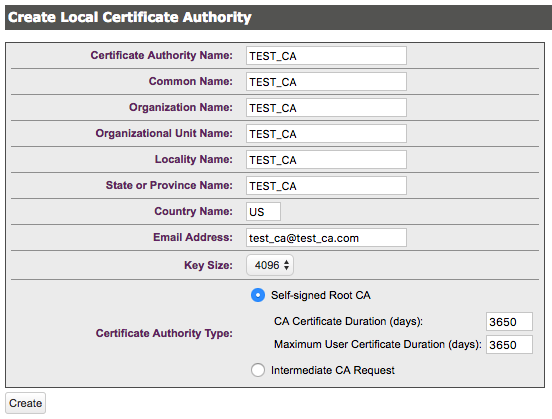  
Your new Local Root CA appears in the Local Certificate Authority List.  
This Root CA will be used to sign your server certificate and your client certificate. Copy the content of your Root CA in your clipboard.  
- Navigate to **Security > Device CAs & SSL Certificates > Trusted CA Lists** and **Add** a new Profile in the list.  
Then, click on your Profile name, **Edit** it and **Add** your Root CA to the list of Trusted CAs. **Save** the profile.  
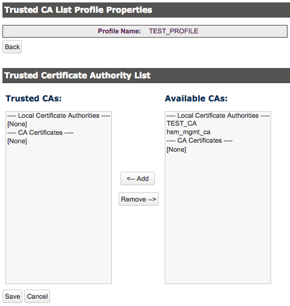

Connect to the machine hosting your MongoDB standalone instance.

- Create a new file */etc/ssl/mongodb_kmip_ca.pem* and paste the content of your clipboard in it.

##### 2. Create a Server Certificate for the KMIP Server

Connect and authenticate to the Safenet KeySecure Web Console.

- Navigate to **Security > Device CAs & SSL Certificates >SSL Certificates**, fill the fields accordingly and click on **Create Certificate request**.  
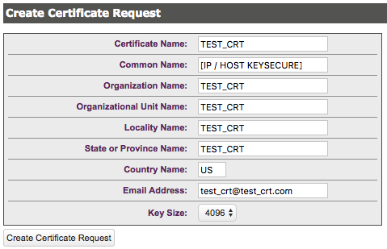  
Your new CSR (Certificate Signing Request) appears in the Certificate List with a status **Request Pending**. Click on its name and copy the content in your clipboard.  
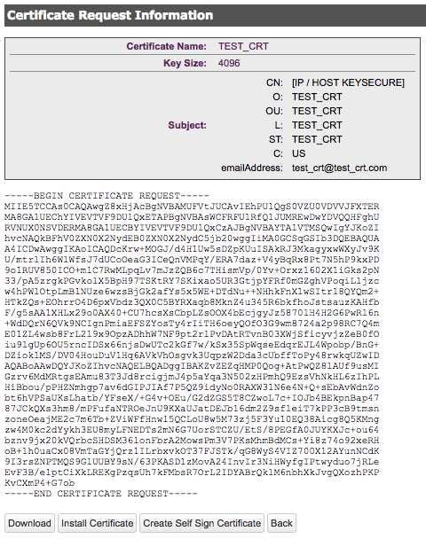  
You must now sign your CSR using your Root CA.
- Navigate to **Security > Device CAs & SSL Certificates > Local CAs**, click on your Root CA name and on **Sign Request**. Paste the content of your clipboard in the **Certificate Request** field, choose your Root CA in the CA list, check **Server** as Certificate Purpose and click on **Sign Request**.  
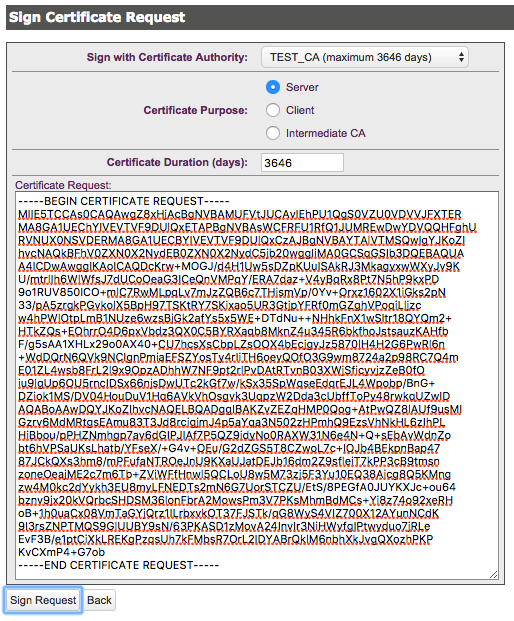  
Copy your Signed Certificate in your clipboard.  
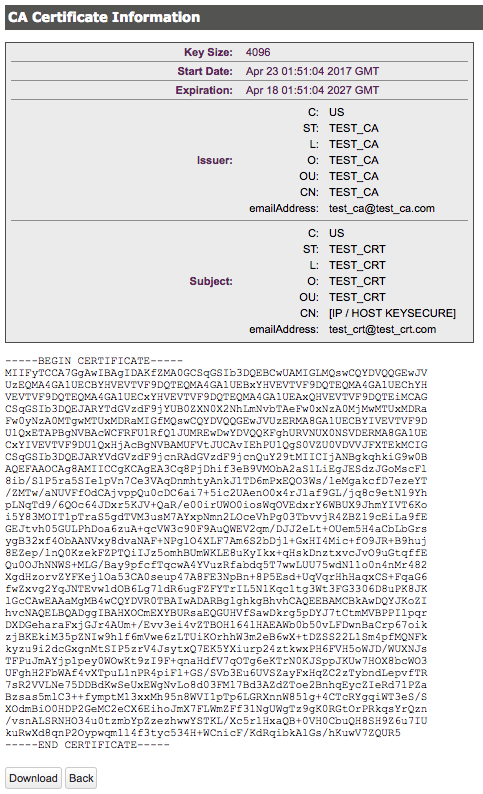  
- Coming back to your Local CA page, your Signed Certificate is available by clicking on **Show Signed Certs**.  
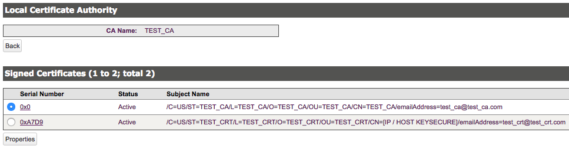  
- Navigate to **Security > Device CAs & SSL Certificates > SSL Certificates**, your Certificate Request is still in **Request Pending** status. You must install your new Signed Certificate in KeySecure to make it usable by your KMIP Server.  
Click on your Certificate Request name and on **Install Certificate**. Then, paste the content of your clipboard into the field and **Save** it.  
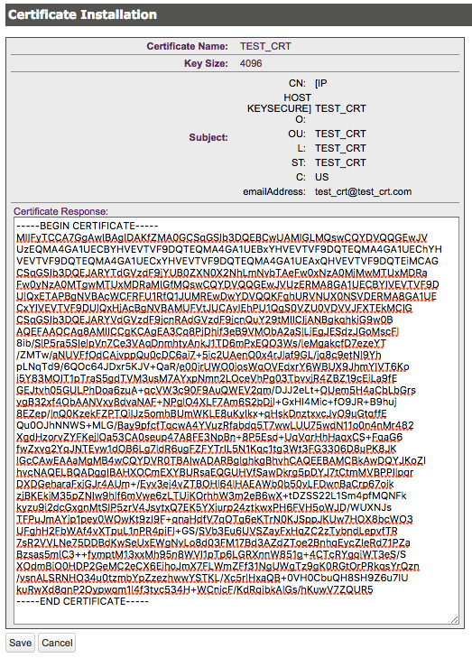  
Your Certificate is not anymore a Certificate Request and has a status **Active**.

##### 3. Create a Client Certificate for the MongoDB Instance

**Optional (Mandatory if Client Authentication enabled)**  
Connect to the machine hosting your MongoDB standalone instance.

- Because KeySecure do not let you access the certificate key when generating the CSR, you must generate the Client Certificate manually.  
The command below generates the CSR and a 4096 bits key using the SHA256 algorithm:  
```bash
openssl req -nodes -newkey rsa:4096 -sha256 -keyout /etc/ssl/mongodb_kmip_client.key -out /etc/ssl/mongodb_kmip_client.csr
```  
Copy the content of mongodb_client.csr in your clipboard, you now need to sign it using KeySecure and your Root CA.

Connect and authenticate to the Safenet KeySecure Web Console.

- Navigate to **Security > Device CAs & SSL Certificates > Local CAs**, click on your Root CA name and on **Sign Request**. Paste the content of your clipboard in the **Certificate Request** field, choose your Root CA in the CA list, check **Client** as Certificate Purpose and click on **Sign Request**.  
Copy your Signed Certificate in your clipboard.
- Coming back to your Local CA page, your Signed Certificate is available by clicking on **Show Signed Certs**.  
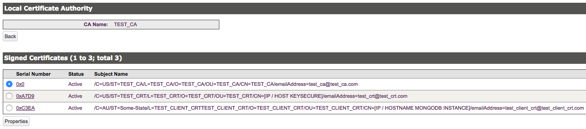  

Connect to the machine hosting your MongoDB standalone instance.

- Create a new file */etc/ssl/mongodb_kmip_client.crt* and paste the content of your clipboard in it.
- Concat the key with your certificate, as required by MongoDB.  
```bash
cat /etc/ssl/mongodb_kmip_client.key /etc/ssl/mongodb_kmip_client.crt > /etc/ssl/mongodb_kmip_client.pem
```

### KMIP Server Setup

Connect and authenticate to the Safenet KeySecure Web Console.

- Navigate to **Device > Key Server > Key Server**, add a new KMIP Server, check **Use SSL**, choose an available port and choose the Server Certificate that you installed previously.  
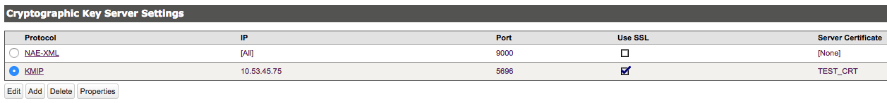  
- **Optional (Mandatory if Client Authentication enabled)**  
Open the properties of your KMIP Server and **Edit** the **Authentication Settings**. Check **Used for SSL session and username (most secure)** to make the Client Certificate Authentication mandatory, choose the profile that you previously created in the **Trusted CA List Profile**, and choose the Certificate field you want to use as username for the authentication (I use **CN** for this tutorial).  
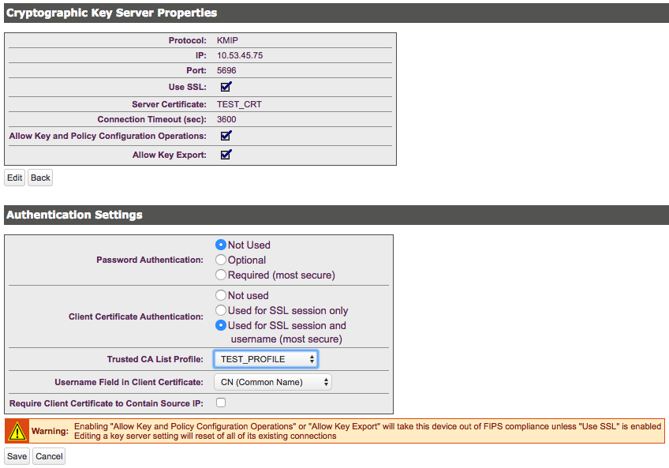  
You now need to add a new user with this username in your KeySecure Instance.
- **Optional (Mandatory if Client Authentication enabled)**  
Navigate to **Security > Users & Groups > Local Authentication > Local Users & Groups** and add a new user. Remember that we defined the **Common Name** of the Client Certificate as **username** for the KMIP Server so both must be the same in the users list. Because the password is **Not Used** in our KMIP Setup, you can put whatever you want (the field cannot be empty however).  
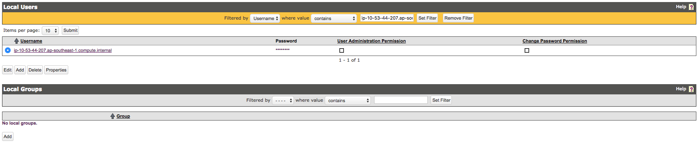  
You now have a user allowed to create keys against your KMIP Server.

### MongoDB - KMIP - Encryption at Rest

Connect to the machine hosting your MongoDB standalone instance.

- Add the Encryption Parameters to the MongoDB Configuration (*/etc/mongod.conf*). 
```yaml
security:
   enableEncryption: true
   kmip:
      serverName: [IP / HOST KEYSECURE] #Exact IP / HOSTNAME as the one used in your kmip server certificate
      port: 5696
      clientCertificateFile: /etc/ssl/mongodb_kmip_client.pem #Optional (Mandatory if Client Authentication enabled)
      serverCAFile: /etc/ssl/mongodb_kmip_ca.pem
```
- Start your Standalone (**You must have no data in your node**). 
You might need to disable selinux.

Connect and authenticate to the Safenet KeySecure Web Console.

- Navigate to **Security > Keys**, you can see that your master key has been created (in my case, the owner is my MongoDB Instance / Hostname because I chose CN as the username for Client Authentication).
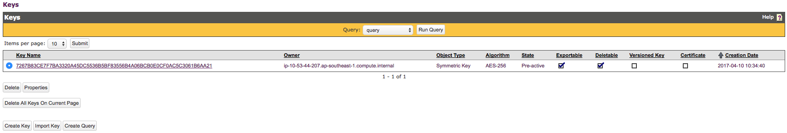  
Screenshot above shows that the key has an owner. That's because I enabled the Client Authentication. As you can see, the key owner, the user created previously and the Common Name of your Client Certificate are exactly the same. Only this user will be able to retrieve the key.  
Key has no owner if Client Authentication is disabled. Note that you can only change the owner of a key, not remove it.

Your data are now encrypted at Rest.


